# <p class="hidden">应用集成案例: </p>Touch遥操RM65

## 项目概述

本项目是一个创新的机器臂案例集成方案，将3D Systems公司生产的触觉式力反馈设备Touch，与睿尔曼RM65机械臂结合，旨在打造一个灵活、高效率的控制案例。通过这一案例，我们能够实现在复杂环境中的敏捷移动和精确操作，满足多样化的作业需求。为该复合机器人实现的可能性做出对应的案例，为后续自主作业系统的开发做出铺垫。<br>
如有需求可基于本案例，可依托其他系列六轴机械臂进行Touch遥操案例的自研开发。

### 项目背景

随着机器人技术在工业、医疗、救援等领域的广泛应用，高精度、低延迟的遥操作系统成为突破复杂操作场景的关键需求。然而，传统机械臂遥操作存在触觉反馈缺失、操作精度不足、人机交互不直观等问题，限制了其在精细化作业中的应用。<br>
本项目通过集成高灵敏度的触觉力反馈设备Touch与超轻量仿人RM65机械臂，构建了一套具备实时反馈的遥操作平台，旨在解决人机交互中的感知断层问题，提升复杂场景下的操作效率与安全性。

### 主要目标

**实现精准力觉交互**：通过Touch设备与RM65机械臂的双向数据同步，实现稳定一致遥操。

**优化低延迟通信**：确保操作指令与反馈信号的实时性（目标延迟＜5ms），提升操作流畅度。

**拓展应用场景**：验证系统在医疗辅助、工业检测、危险环境作业等领域的适用性。

### 核心功能

**遥操作**：

- **操作端**：Touch设备实时捕捉用户手部动作信息，转换为机械臂运动指令。
- **反馈端**（RM65-6F可拓展）：机械臂末端力/力矩传感器数据经处理后，通过Touch设备生成触觉反馈，模拟真实环境阻力。

### 技术亮点

- **低延迟通信架构**：
   Touch端1000HZ频率采样Touch关节信息，通过TCP网线传输信息给机械臂，机械臂端可以最高200HZ频率控制机械臂运动，确保信号同步性。
- **关节映射算法可调**：
   用户可自行更改关节映射方式以适应不同的场景使用。
- **模块化设计**：
   硬件接口与软件协议标准化，支持快速适配及搭建。

## 硬件环境

### 硬件基础介绍

Touch的开箱使用详见[用户开箱手册](Touch+&+TouchX+User_Guide_USB.pdf)，务必按照手册正确操作和控制力反馈设备伺服回路，主机需要具有足够的“实时”性能。使用力反馈设备时，需要使用专用计算机才能确保提供最佳性能和体验。否则，可能会导致与力反馈设备的通信变慢、不一致或断断续续，从而导致设备挂起或关闭。

- 计算机最低配置要求如下：

  - **操作系统：** 64 位 Windows 10 和 11
  - **处理器：** Intel i5/i7，第 5 代或更高版本的 CPU，最低频率为 2.5 GHz
  - **RAM：** 最低 4 GB
  - **显卡：** 最低 256 MB VRAM（安装最新驱动程序）
  - **磁盘空间：** 512 MB
  - **显示屏分辨率接口：** 1280 x 800（最小值）

- **Touch 或 Touch X**：支持 USB 2.0/3.0 的 USB 2.0/3.0 端口或 USB 集线器。无论选择哪种卡，都请确保按照制造商的说明使用最新的驱动程序。

- **睿尔曼RM65系列机械臂**：该系列产品为六自由度且负载5kg的机械臂，如果是RM65-6F机械臂，则末端含有六维力传感器可用来配合力位混合控制用来补偿末端位姿，优化机械臂指点控制性能，结合Touch的力反馈可完成力控。

请在Touch和机械臂正常通电后，将Touch的USB数据线接到主控上，并用网线连接主控和机械臂，夹爪连接到机械臂末端，至此就完成了全部硬件连接。

### 硬件通信框架

整体示例逻辑就是通过SDK读取Touch的六轴关节数据，然后将数据映射到RM65机械臂上，通过机械臂的透传API下发，从而实现遥操作功能。

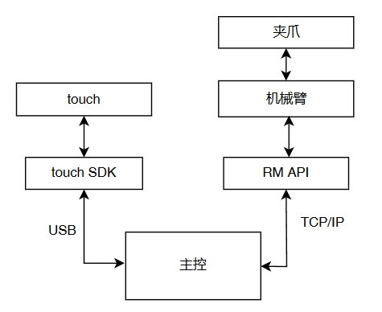

<center>通信架构</center>

## 软件配套

|序号|软件|版本|
|:-:|:-:|:-:|
|1|三代控制器|V 1.7.0|
|2|API2|V1.0.7|

## 准备阶段

### 机械臂配置

用户电脑与机械臂通过网口连接之后，电脑IP需配置成`192.168.1.xxx`，机械臂IP出厂默认为`192.168.1.18`。打开浏览器在网址栏输入`192.168.1.18`进入示教器，将拓展栏里面的末端夹爪电压设置成24V用以给夹爪提供电能。

### Touch配置

1. 首先进入[Touch驱动](https://support.3dsystems.com/s/article/Haptic-Device-Drivers?language=en_US&_gl=1*1c8cu9*_gcl_au*MTM1NjEwMzM2OC4xNzQxNzQzMzcy*_ga*OTIzNzY2NDgwLjE3MTMyNTExNDE.*_ga_9G6ZBH6DZM*MTc0MTg0NTg4Mi4xNS4xLjE3NDE4NDU5NzUuNDguMC4xMjI4MDc1NTc0)官网下载Touch所需要的最新设备驱动和开发包。

   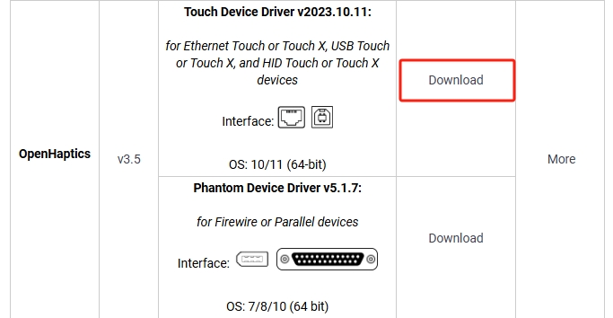

2. 按照提示完成Touch驱动安装，当驱动安装完成后，桌面上会新增如下两个图标，其中第一个是演示demo、第二个是智能配置。

   ::: tip 说明
   - 电脑第一次运行Touch，需要点Smart Setup进行配置，后续运行无需再配置。
   - 如果出现连接不上时，请使用Diagnostic进行诊断。Diagnostic在你安装的时候选择的安装路径下。
   :::

   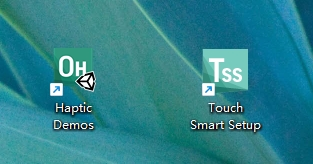

3. 请访问[Touch开发包](https://support.3dsystems.com/s/article/OpenHaptics-for-Windows-Developer-Edition-v35?language=en_US)下载并安装Touch开发包。

   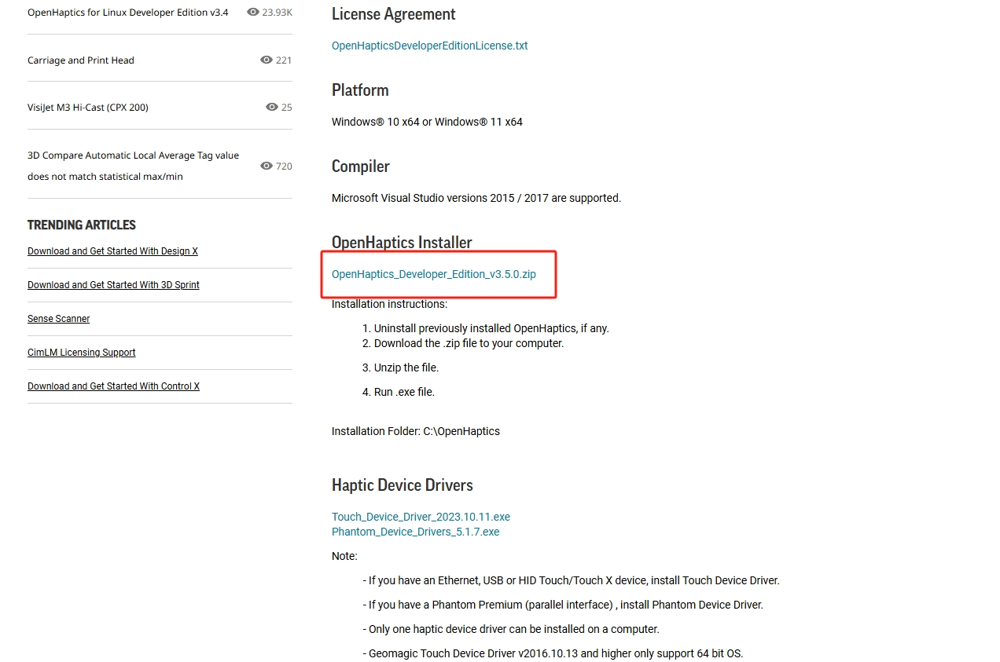

4. 安装完成后会自动生成如下文件。

   ::: tip 说明
   请记录文件存放路径，本文以D:/openhaptics为例说明如何在VS2017中配置开发环境。
   :::

   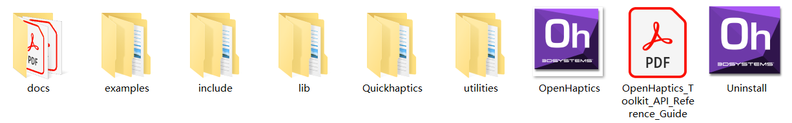

### Visual Studio 2017安装配置

1. 请下载Visual Studio 2017，并双击该文件，如果.Net Framework版本没有问题，则会进入安装页面。

   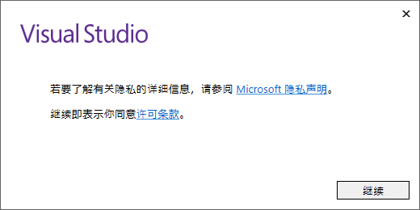

2. 点击`继续`按钮，Visual Studio开始准备安装。

   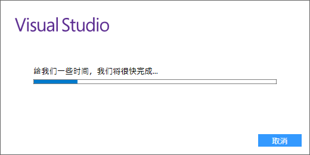

3. 当Visual Studio准备完成后，进入如下页面。

   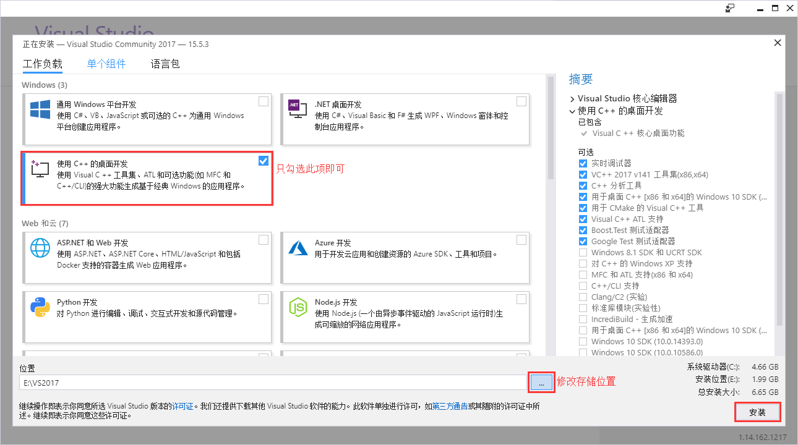

4. 选择`使用C++的桌面开发`并修改存储位置，然后点击`安装`，开始安装Visual Studio，安装过程可能需要一段时间，大家耐心等待。

   ::: tip 说明
   - VS 2017 除了支持 C/C++ 开发，还支持 C#、F#、Visual Basic 等开发语言，此处仅需要安装`使用C++的桌面开发`即可。
   - VS 2017的存储位置，建议不要安装在C盘。
   :::

   

5. 安装完成后，请重启计算机。然后，双击启动Visual Studio 2017，并按照提示登陆和配置环境。<br>
   此处请直接在Touch预先建立的VS工程中做修改，请访问Console，并使用Visual Studio打开ConsoleExamples_VS2017.sln解决方案文件，若提示需要重定解决目标，点击确认即可。

   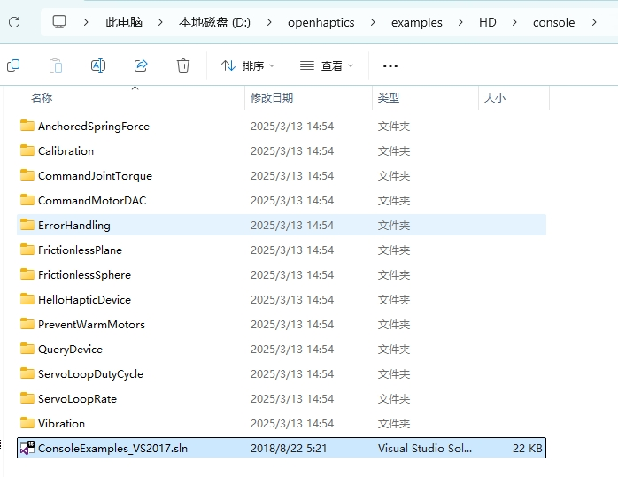

   **console**中各个例程的演示内容：

   - AnchoredSpringForce--模拟弹簧力；
   - Calibration--设备信息查验；
   - CommandJointTorque--模拟关节弹簧力矩；
   - CommandMotorDAC--直接控制Touch内电机的运动；
   - ErrorHandling--错误类型展示；
   - FrictionlessPlane--模拟一个无摩擦平面；
   - FrictionlessSphere--模拟一个无摩擦球体；
   - HelloHapticDevice--模拟一个重力井；
   - PreventWarmMotors--输出电机温度信息；
   - QueryDevice--设备信息打印（有调用笔上按钮）；
   - ServoLoopDutyCycle--打印设备的执行时间情况；
   - ServoLoopRate--打印更新频率情况；
   - Vibration--模拟正弦振动；

6. 头文件存放路径选择。
   - 点击右侧QueryDevice示例，打开QueryDevice.c源文件，源代码显示在左边，QueryDevice可以看到Touch示例中头文件引用的位置，可以将RM65机械臂的API头文件也存放至D:\openhaptics\include\HD下，此时在源代码中添加rm头文件亦可以识别。

   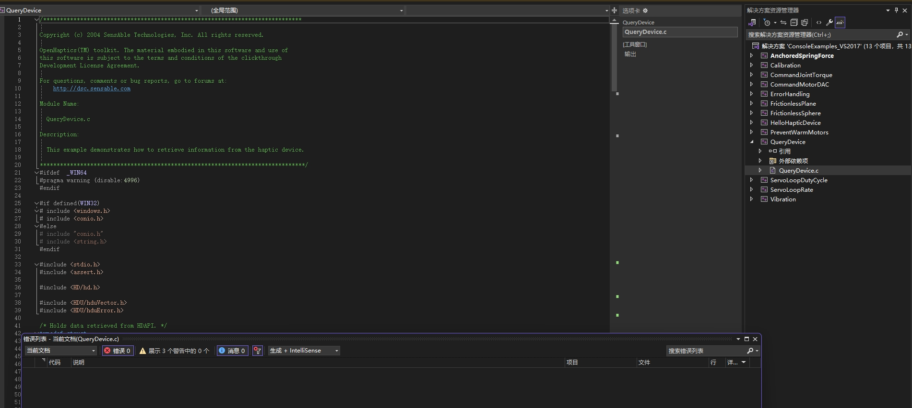

   - 如果需要将RM头文件与Touch头文件分开存放，请右键点击QueryDevice，选择属性，打开在左边栏中选择C/C++，并在常规中的附加包含目录中，添加存放RM头文件的路径，即可在代码中使用对应的路径。

   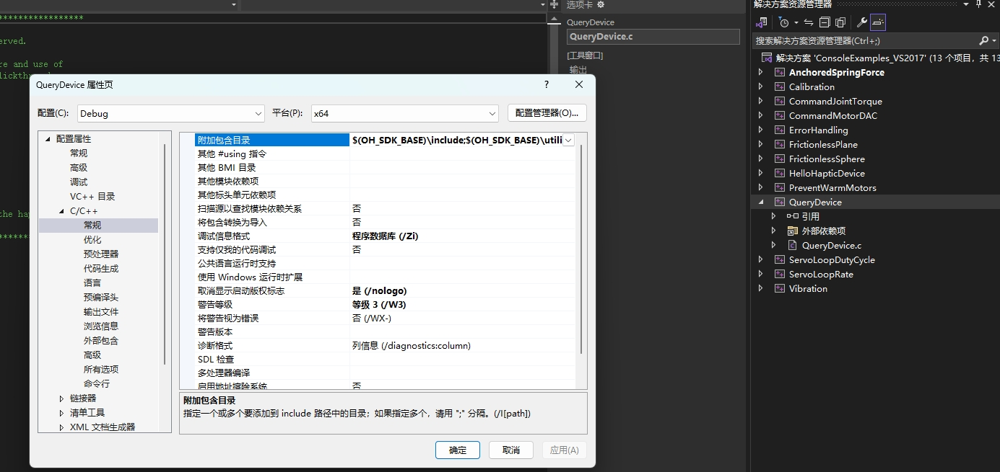

7. 选择链接器，在常规中的附加库目录添加你存放RM库的lib文件路径。

   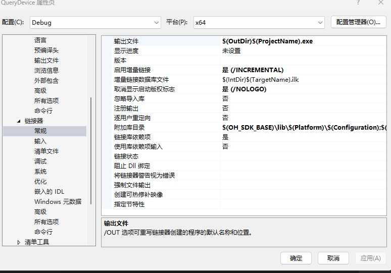

8. 将DLL复制到包含客户端可执行文件的目录中，作为生成过程的一部分。

   - 在项目属性页中，选择“配置属性”>“生成事件”>“生成后事件”。
   - 在“命令行”字段中选择编辑打开编辑控件，输入以下命令：

   ```C
   xcopy /y /d "..\lib\api_c.dll" "$(OutDir)"
   ```

   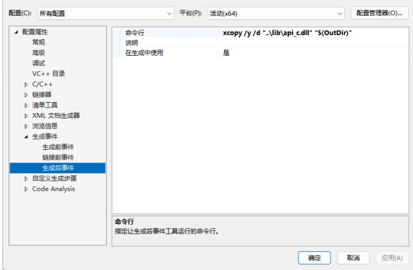

9. 此时环境配置基本完成，然后转到源代码中，如下示例代码是使用Windows下的C语言API库，基本思路就是先读取Touch数据，然后映射给机械臂。若环境配置为C语言API，即可直接复制下面代码生成解决方案。

   ```C
   /*****************************************************************************

   Copyright (c) 2004 SensAble Technologies, Inc. All rights reserved.

   OpenHaptics(TM) toolkit. The material embodied in this software and use of
   this software is subject to the terms and conditions of the clickthrough
   Development License Agreement.

   For questions, comments or bug reports, go to forums at:
      http://dsc.sensable.com

   Module Name:

   QueryDevice.c

   Description:

   This example demonstrates how to retrieve information from the haptic device.

   *******************************************************************************/
   #ifdef  _WIN64
   #pragma warning (disable:4996)
   #endif

   #if defined(WIN32)
   # include <windows.h>
   # include <conio.h>
   #else
   # include "conio.h"
   # include <string.h>
   #endif

   #include <stdio.h>
   #include <assert.h>

   #include <HD/hd.h>
   #include <HDU/hduQuaternion.h>
   #include <HDU/hduVector.h>
   #include <HDU/hduError.h>
   #include <HD/rm_service.h>

   RM_Service robotic_arm;

   /* Assumes the unit is a PHANTOM from SensAble Technologies, Inc. */
   #define MAX_INPUT_DOF   6   
   #define MAX_OUTPUT_DOF  6

   static int gNumMotors = 0;
   static int gNumEncoders = 0;

   static long alMotorDACValuesApp[MAX_OUTPUT_DOF];
   static long alMotorDACValuesServo[MAX_OUTPUT_DOF];

   /* Holds data retrieved from HDAPI. */

   struct OmniState {
      hduVector3Dd position;  //3x1 vector of position
      hduVector3Dd velocity;  //3x1 vector of velocity
      hduVector3Dd inp_vel1;  //3x1 history of velocity used for filtering velocity estimate
      hduVector3Dd inp_vel2;
      hduVector3Dd inp_vel3;
      hduVector3Dd out_vel1;
      hduVector3Dd out_vel2;
      hduVector3Dd out_vel3;
      hduVector3Dd pos_hist1; //3x1 history of position used for 2nd order backward difference estimate of velocity
      hduVector3Dd pos_hist2;
      // hduQuaternion rot;
      hduVector3Dd joints;
      hduVector3Dd force;   //3 element double vector force[0], force[1], force[2]
      float thetas[7];
      int buttons[2];
      int buttons_prev[2];
      bool lock;
      bool close_gripper;
      hduVector3Dd lock_pos;
      double units_ratio;
   };

   typedef struct
   {
      HDboolean m_buttonState;       /* Has the device button has been pressed. */
      HDboolean n_buttonState;
      hduVector3Dd m_devicePosition; /* Current device coordinates. */
      HDErrorInfo m_error;
      hduVector3Dd joints;
      float thetas[7];
      float pos[6];
      float rm_force[6];
      float rm_zero_force[6];
      float work_zero[6];
      float tool_zero[6];
   } DeviceData;

   static DeviceData gServoDeviceData;

   HDSchedulerHandle gCallbackHandle = HD_INVALID_HANDLE;
   /*******************************************************************************
   Checks the state of the gimbal button and gets the position of the device.
   *******************************************************************************/
   HDCallbackCode HDCALLBACK updateDeviceCallback(void* pUserData)
   {
      int nButtons = 0;

      hdBeginFrame(hdGetCurrentDevice());

      /* Retrieve the current button(s). */
      hdGetIntegerv(HD_CURRENT_BUTTONS, &nButtons);
      assert(alMotorDACValuesServo);

      hdSetLongv(HD_CURRENT_MOTOR_DAC_VALUES, alMotorDACValuesServo);

      /* In order to get the specific button 1 state, we use a bitmask to
         test for the HD_DEVICE_BUTTON_1 bit. */
      gServoDeviceData.m_buttonState =
         (nButtons & HD_DEVICE_BUTTON_1) ? HD_TRUE : HD_FALSE;
      gServoDeviceData.n_buttonState =
         (nButtons & HD_DEVICE_BUTTON_2) ? HD_TRUE : HD_FALSE;

      /* Get the current location of the device (HD_GET_CURRENT_POSITION)
         We declare a vector of three doubles since hdGetDoublev returns
         the information in a vector of size 3. */
      hdGetDoublev(HD_CURRENT_POSITION, gServoDeviceData.m_devicePosition);
      hdGetDoublev(HD_CURRENT_JOINT_ANGLES, gServoDeviceData.joints);
      hduVector3Dd gimbal_angles;
      hdGetDoublev(HD_CURRENT_GIMBAL_ANGLES, gimbal_angles);

      float t[7] = { 0., gServoDeviceData.joints[0], gServoDeviceData.joints[1],
      gServoDeviceData.joints[2] - gServoDeviceData.joints[1], gimbal_angles[0],
      gimbal_angles[1], gimbal_angles[2] };
      for (int i = 0; i < 7; i++)
         gServoDeviceData.thetas[i] = t[i];
      /* Also check the error state of HDAPI. */
      gServoDeviceData.m_error = hdGetError();

      /* Copy the position into our device_data tructure. */
      hdEndFrame(hdGetCurrentDevice());

      return HD_CALLBACK_CONTINUE;
   }


   /*******************************************************************************
   Checks the state of the gimbal button and gets the position of the device.
   *******************************************************************************/
   HDCallbackCode HDCALLBACK copyDeviceDataCallback(void* pUserData)
   {
      DeviceData* pDeviceData = (DeviceData*)pUserData;

      memcpy(pDeviceData, &gServoDeviceData, sizeof(DeviceData));

      return HD_CALLBACK_DONE;
   }


   /*****************************************************************************
   Copies state in thread-safe manner.
   *****************************************************************************/
   HDCallbackCode HDCALLBACK UpdateMotorDACValuesCallback(void* pUserData)
   {
      memcpy(alMotorDACValuesServo,
         alMotorDACValuesApp,
         sizeof(long) * MAX_OUTPUT_DOF);

      return HD_CALLBACK_DONE;
   }


   /*******************************************************************************
   This routine allows the device to provide information about the current
   location of the stylus, and contains a mechanism for terminating the
   application.
   Pressing the button causes the application to display the current location
   of the device.
   Holding the button down for N iterations causes the application to exit.
   *******************************************************************************/
   void mainLoop(rm_robot_handle* robot_handle)
   {
      static const int kTerminateCount = 1000;
      int buttonHoldCount = 0;
      int count = 0;
      bool movej_flag = false;
      bool gripper_flag = false;
      printf("*******************mainloop**********************");
      /* Instantiate the structure used to capture data from the device. */
      DeviceData currentData;
      DeviceData prevData;

      /* Perform a synchronous call to copy the most current device state. */
      hdScheduleSynchronous(copyDeviceDataCallback,
         &currentData, HD_MIN_SCHEDULER_PRIORITY);

      memcpy(&prevData, &currentData, sizeof(DeviceData));


      /* Run the main loop until the gimbal button is held. */
      while (1)
      {
         /* Perform a synchronous call to copy the most current device state.
            This synchronous scheduler call ensures that the device state
            is obtained in a thread-safe manner. */

         hdScheduleSynchronous(copyDeviceDataCallback,
               &currentData,
               HD_MIN_SCHEDULER_PRIORITY);

         hdScheduleSynchronous(UpdateMotorDACValuesCallback,
               0, HD_DEFAULT_SCHEDULER_PRIORITY);

         for (int i = 1; i < 7; ++i) {
               // Calculate the absolute difference between current value and previous value
               double diff = fabs(currentData.thetas[i] - prevData.thetas[i]);


               // Check if the difference is greater than the threshold
               if (diff > 0.002) {
                  // If difference is greater, update the value
                  gServoDeviceData.thetas[i] = currentData.thetas[i]; // Update to the threshold value
               }
               else
               {
                  gServoDeviceData.thetas[i] = prevData.thetas[i];
               }
         }

         gServoDeviceData.pos[0] = -gServoDeviceData.thetas[1] * 70;
         gServoDeviceData.pos[1] = 60 - (45 * gServoDeviceData.thetas[2]);
         gServoDeviceData.pos[2] = 85 - (45 * gServoDeviceData.thetas[3]);
         gServoDeviceData.pos[3] = -gServoDeviceData.thetas[4] * 30;
         gServoDeviceData.pos[4] = 70 - (20 * gServoDeviceData.thetas[5]);
         gServoDeviceData.pos[5] = gServoDeviceData.thetas[6] * 30;
         count++;

         //int ret0 = Get_Force_Data(m_sockhand, gServoDeviceData.rm_force, gServoDeviceData.rm_zero_force, gServoDeviceData.work_zero, gServoDeviceData.tool_zero);


         /* If the user depresses the gimbal button, display the current
            location information. */
         if (currentData.m_buttonState && !prevData.m_buttonState)
         {
               uint16_t Arm_Err; uint16_t Sys_Err;
               int ret2 = robotic_arm.rm_movej(robot_handle, gServoDeviceData.pos, 20, 0, 0, 1);
               printf("*******************pos:\n%f\n%f\n%f\n%f\n%f\n%f\n**********************", gServoDeviceData.pos[0], gServoDeviceData.pos[1], gServoDeviceData.pos[2], gServoDeviceData.pos[3], gServoDeviceData.pos[4], gServoDeviceData.pos[5]);

               if (ret2 == 0)
               {
                  movej_flag = !movej_flag;
               }
         }
         else if (currentData.n_buttonState && prevData.n_buttonState)
         {
               /* Keep track of how long the user has been pressing the button.
                  If this exceeds N ticks, then terminate the application. */
               buttonHoldCount++;

               if (buttonHoldCount > kTerminateCount)
               {
                  /* Quit, since the user held the button longer than
                     the terminate count. */

               }
         }
         else if (!currentData.m_buttonState && prevData.m_buttonState)
         {
               /* Reset the button hold count, since the user stopped holding
                  down the stylus button. */

               buttonHoldCount = 0;
         }

         if (movej_flag)
         {

               int ret4 = robotic_arm.rm_movej_canfd(robot_handle, gServoDeviceData.pos, false, 0);
               //printf("*******************pos:\n%f\n%f\n%f\n%f\n%f\n%f\n**********************", gServoDeviceData.thetas[1], gServoDeviceData.thetas[2], gServoDeviceData.thetas[3], gServoDeviceData.thetas[4], gServoDeviceData.thetas[5], gServoDeviceData.thetas[5]);

         }
         if (currentData.n_buttonState && !prevData.n_buttonState)
         {
               gripper_flag = !gripper_flag;
               if (!gripper_flag)
               {
                  int ret3 = robotic_arm.rm_set_gripper_release(robot_handle, 500, true, 30);

                  printf("******************Gripper_close********************/n");
               }
               if (gripper_flag)
               {
                  int ret6 = robotic_arm.rm_set_gripper_pick(robot_handle, 500, 1000, true, 0);
                  printf("*****************Gripper_Pick_On************************/n");
               }

         }

         /* Check if an error occurred. */
         if (HD_DEVICE_ERROR(currentData.m_error))
         {
               hduPrintError(stderr, &currentData.m_error, "Device error detected");

               if (hduIsSchedulerError(&currentData.m_error))
               {
                  /* Quit, since communication with the device was disrupted. */
                  fprintf(stderr, "\nPress any key to quit.\n");
                  getch();
                  break;
               }
         }

         /* Store off the current data for the next loop. */
         memcpy(&prevData, &currentData, sizeof(DeviceData));
      }
   }

   void custom_api_log(const char* message, va_list args) {
      if (!message) {
         fprintf(stderr, "Error: message is a null pointer\n");
         return;
      }

      char buffer[1024];
      vsnprintf(buffer, sizeof(buffer), message, args);
      printf(" %s\n", buffer);
   }

   /*******************************************************************************
   Main function.
   Sets up the device, runs main application loop, cleans up when finished.
   *******************************************************************************/
   int main(int argc, char* argv[])
   {
      //  ��ʼ����е�����Ӻ�touch����
      HDSchedulerHandle hUpdateHandle = 0;
      HDErrorInfo error;
      int result = -1;

      robotic_arm.rm_set_log_call_back(custom_api_log, 3);
      result = robotic_arm.rm_init(RM_TRIPLE_MODE_E);
      if (result != 0) {
         printf("Initialization failed with error code: %d.\n", result);
         return -1;
      }

      char* api_version = robotic_arm.rm_api_version();
      printf("API Version: %s.\n", api_version);

      const char* robot_ip_address = "192.168.1.19";
      int robot_port = 8080;
      rm_robot_handle* robot_handle = robotic_arm.rm_create_robot_arm(robot_ip_address, robot_port);
      if (robot_handle == NULL) {
         printf("Failed to create robot handle.\n");
         return -1;
      }
      else {
         printf("Robot handle created successfully: %d\n", robot_handle->id);
      }

      /* Initialize the device, must be done before attempting to call any hd
         functions. */
      HHD hHD = hdInitDevice(HD_DEFAULT_DEVICE);
      if (HD_DEVICE_ERROR(error = hdGetError()))
      {
         hduPrintError(stderr, &error, "Failed to initialize the device");
         fprintf(stderr, "\nPress any key to quit.\n");
         getch();
         return -1;
      }
      hdGetIntegerv(HD_OUTPUT_DOF, &gNumMotors);
      hdGetIntegerv(HD_INPUT_DOF, &gNumEncoders);

      memset(alMotorDACValuesApp, 0, sizeof(long) * MAX_OUTPUT_DOF);
      memset(alMotorDACValuesServo, 0, sizeof(long) * MAX_OUTPUT_DOF);

      /* Schedule the main scheduler callback that updates the device state. */
      hUpdateHandle = hdScheduleAsynchronous(
         updateDeviceCallback, 0, HD_MAX_SCHEDULER_PRIORITY);
      hdEnable(HD_FORCE_OUTPUT);
      /* Start the servo loop scheduler. */
      hdStartScheduler();
      if (HD_DEVICE_ERROR(error = hdGetError()))
      {
         hduPrintError(stderr, &error, "Failed to start the scheduler");
         fprintf(stderr, "\nPress any key to quit.\n");
         getch();
         return -1;
      }

      /* Run the application loop. */
      mainLoop(robot_handle);

      /* For cleanup, unschedule callbacks and stop the servo loop. */
      hdStopScheduler();
      hdUnschedule(hUpdateHandle);
      hdUnschedule(gCallbackHandle);
      hdDisableDevice(hHD);

      return 0;
   }
   /******************************************************************************/
   ```

10. 退出后右键点击QueryDevice示例，选择重新生成，记录生成路径。

## 运行演示

在生成路径下，找到可执行exe文件，双击打开，等待连接成功提示，接着按下Touch手柄的上方按钮，让机械臂到达和Touch一样的姿态，到达后机械臂就自动开启跟随Touch运动，Touch手柄的下方按钮是控制夹爪闭合和张开，按一下切换夹爪状态。

<style>
  .video-container {
    display: flex;
    justify-content: center; /* 水平方向居中 */
    align-items: center; /* 垂直方向居中 */
  }
</style>

<div class="video-container">
  <video controls width="500px" height="400px" autoplay loop muted>
    <source src="https://ik.imagekit.io/Realman/Video/%E6%BC%94%E7%A4%BA%E8%A7%86%E9%A2%91.mp4?updatedAt=1742194612658" type="video/mp4">
  </video>
</div>

## 关键代码分析

1. 存放设备信息的结构体信息定义。

   ```C
   //    Touch SDK中的状态信息结构体
   struct OmniState {
      hduVector3Dd position;  //3x1 vector of position
      hduVector3Dd velocity;  //3x1 vector of velocity
      hduVector3Dd inp_vel1;  //3x1 history of velocity used for filtering velocity estimate
      hduVector3Dd inp_vel2;
      hduVector3Dd inp_vel3;
      hduVector3Dd out_vel1;
      hduVector3Dd out_vel2;
      hduVector3Dd out_vel3;
      hduVector3Dd pos_hist1; //3x1 history of position used for 2nd order backward difference estimate of velocity
      hduVector3Dd pos_hist2;
      hduQuaternion rot;
      hduVector3Dd joints;
      hduVector3Dd force;   //3 element double vector force[0], force[1], force[2]
      float thetas[7];
      int buttons[2];
      int buttons_prev[2];
      bool lock;
      bool close_gripper;
      hduVector3Dd lock_pos;
      double units_ratio;
   };

   //   映射给机械臂和下发给机械臂信息的结构体
   typedef struct
   {
      HDboolean m_buttonState;       /* Has the device button has been pressed. */
      HDboolean n_buttonState;
      hduVector3Dd m_devicePosition; /* Current device coordinates. */
      HDErrorInfo m_error;
      hduVector3Dd joints;
      float thetas[7];
      float pos[6];
      float rm_force[6];
      float rm_zero_force[6];
      float work_zero[6];
      float tool_zero[6];
   } DeviceData;
   ```

2. Touch数据实时获取。

   ```C
   //  获取Touch的数据，包括六个关节和两个按钮状态
   HDCallbackCode HDCALLBACK updateDeviceCallback(void *pUserData)
   {
      int nButtons = 0;

      hdBeginFrame(hdGetCurrentDevice());
      
      /* Retrieve the current button(s). */
      hdGetIntegerv(HD_CURRENT_BUTTONS, &nButtons);
      assert(alMotorDACValuesServo);
      
      hdSetLongv(HD_CURRENT_MOTOR_DAC_VALUES, alMotorDACValuesServo);
      
      /* In order to get the specific button 1 state, we use a bitmask to
         test for the HD_DEVICE_BUTTON_1 bit. */
      gServoDeviceData.m_buttonState =
         (nButtons & HD_DEVICE_BUTTON_1) ? HD_TRUE : HD_FALSE;
      gServoDeviceData.n_buttonState =
         (nButtons & HD_DEVICE_BUTTON_2) ? HD_TRUE : HD_FALSE;
      
      /* Get the current location of the device (HD_GET_CURRENT_POSITION)
         We declare a vector of three doubles since hdGetDoublev returns
         the information in a vector of size 3. */
      hdGetDoublev(HD_CURRENT_POSITION, gServoDeviceData.m_devicePosition);
      hdGetDoublev(HD_CURRENT_JOINT_ANGLES, gServoDeviceData.joints);
      hduVector3Dd gimbal_angles;
      hdGetDoublev(HD_CURRENT_GIMBAL_ANGLES, gimbal_angles);
      
      float t[7] = { 0., gServoDeviceData.joints[0], gServoDeviceData.joints[1],
      gServoDeviceData.joints[2] - gServoDeviceData.joints[1], gimbal_angles[0],
      gimbal_angles[1], gimbal_angles[2] };
      
      //  Touch的数据获取
      for (int i = 0; i < 7; i++)
         gServoDeviceData.thetas[i] = t[i];
      /* Also check the error state of HDAPI. */
      gServoDeviceData.m_error = hdGetError();
      
      /* Copy the position into our device_data tructure. */
      hdEndFrame(hdGetCurrentDevice());
      
      return HD_CALLBACK_CONTINUE;
   }
   ```

3. 将数据重新映射到机械臂。<br>
   由于两者构型和数值范围不一样，因此需要进行自设定的计算方式，这里将RM机械臂的运动范围和Touch的运动范围进行对齐，比如Touch关节3的运动范围值是-0.7-1.2，RM65机械臂的关节3运动范围是-178°-178°，就将两个范围计算一下映射关系，得到关系式，后续都使用这样的关系式更新Touch获取的数据以下发控制机械臂。由于Touch的数据有波动，因此还可以在中间加入滤波算法，以获取机械臂平滑的控制效果。

   ```C
   for (int i = 1; i < 7; ++i) {
      // Calculate the absolute difference between current value and previous value
      double diff = fabs(currentData.thetas[i] - prevData.thetas[i]);


      // Check if the difference is greater than the threshold
      // 简单滤波
      if (diff > 0.002) {
         // If difference is greater, update the value
         gServoDeviceData.thetas[i] = currentData.thetas[i]; // Update to the threshold value
      }
      else
      {
         gServoDeviceData.thetas[i] = prevData.thetas[i];
      }
   }
   // 映射关系设置
   gServoDeviceData.pos[0] = -gServoDeviceData.thetas[1] * 70;
   gServoDeviceData.pos[1] = 60 - (45 * gServoDeviceData.thetas[2]);
   gServoDeviceData.pos[2] = 85 - (45 * gServoDeviceData.thetas[3]);
   gServoDeviceData.pos[3] = -gServoDeviceData.thetas[4] * 30;
   gServoDeviceData.pos[4] = 70 - (20 * gServoDeviceData.thetas[5]);
   gServoDeviceData.pos[5] = gServoDeviceData.thetas[6] * 30;
   count++;
   ```

4. 调整下发的间隔。因Touch的下发频率是1000HZ，而机械臂透传控制最好是在100HZ左右，故需要调整收发的间隔。

   ```C
   // 检测Touch手柄的上方按钮，按下的话就同步机械臂姿态和Touch一样
   if (currentData.m_buttonState && !prevData.m_buttonState)
   {
      uint16_t Arm_Err; uint16_t Sys_Err;
      int ret2 = robotic_arm.rm_movej(robot_handle, gServoDeviceData.pos, 20, 0, 0, 1);
      printf("*******************pos:\n%f\n%f\n%f\n%f\n%f\n%f\n**********************", gServoDeviceData.pos[0], gServoDeviceData.pos[1], gServoDeviceData.pos[2], gServoDeviceData.pos[3], gServoDeviceData.pos[4], gServoDeviceData.pos[5]);

      if (ret2 == 0)
      {
         movej_flag = !movej_flag;
      }
   }
   ```

5. 夹爪控制方法。

   ```C
   // 夹爪控制是以开始的时候的夹爪状态为gripper_flag，按下一次取反一次，完成张开和闭合
   if (currentData.n_buttonState && !prevData.n_buttonState)
   {
      gripper_flag = !gripper_flag;
      if (!gripper_flag)
      {
         int ret3 = robotic_arm.rm_set_gripper_release(robot_handle, 500, true, 30);
         printf("******************Gripper_close********************/n");
      }
      if (gripper_flag)
      {
         int ret6 = robotic_arm.rm_set_gripper_pick(robot_handle, 500, 1000, true, 0);
         printf("*****************Gripper_Pick_On************************/n");
      }

   }
   ```

6. 如果是RM65-6F的六维力机械臂版本，请参考如下代码读取机械臂的六维力信息，通过Touch的Motor控制SDK给Touch力反馈信息，完成力反馈控制。

   ```C
   if (movej_flag)
   {
      alMotorDACValuesApp[0] = -gServoDeviceData.rm_zero_force[0] * 500;
      alMotorDACValuesApp[1] = gServoDeviceData.rm_zero_force[2] * 500;
      alMotorDACValuesApp[2] = gServoDeviceData.rm_zero_force[1] * 500;
      int ret4 = robotic_arm.rm_movej_canfd(robot_handle, gServoDeviceData.pos, false, 0);
      //printf("*******************pos:\n%f\n%f\n%f\n%f\n%f\n%f\n**********************", gServoDeviceData.thetas[1], gServoDeviceData.thetas[2], gServoDeviceData.thetas[3], gServoDeviceData.thetas[4], gServoDeviceData.thetas[5], gServoDeviceData.thetas[5]);
   }
   ```

## 更新日志

|  更新日期  |       更新内容        | 版本号 |
| :--------: | :-------------------: | :----: |
| 2025/04/11 | Touch遥操RM65初版发布 | v1.0.0 |

## 常见问题

1. API头文件等配置错误，检查属性中的设置是否正确，VS2017中是否有错误提示。

   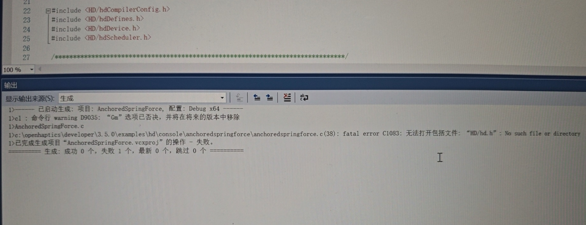

2. 运行可执行exe文件时，报错msvcp140.dll丢失，或者其他版本的缺失，可以直接在网上搜索新的缺失文件，放入工程文件夹中，或者替换电脑中的文件。

   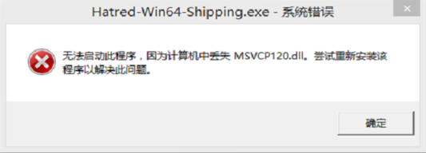

3. 启动应用的时候可能会报错程序错误，可以重新安装Touch的驱动解决。

   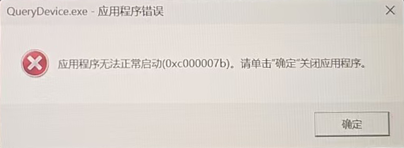
